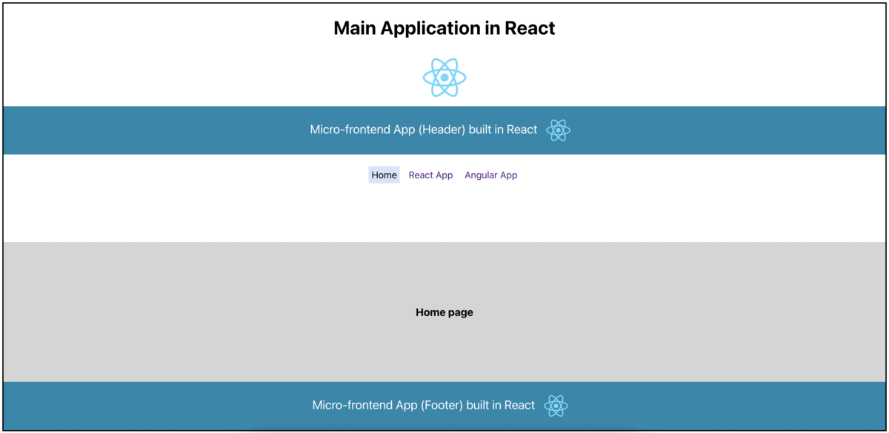

# Micro-frontends

**Using Webpack Module federation with linking**



### Running Locally (do the following in each folder as well as in root folder)
```
npm i 
```

### To start (it will run all apps concurrently)
```
npm run start
```

References:
* https://medium.com/@js_code/using-multiple-frameworks-in-a-single-application-with-module-federation-in-2023-angular-and-893e8488c066
* https://techblog.geekyants.com/building-a-micro-frontend-using-react-and-angular
* https://betterprogramming.pub/angularjs-react-one-component-at-a-time-4e39c0b14916

